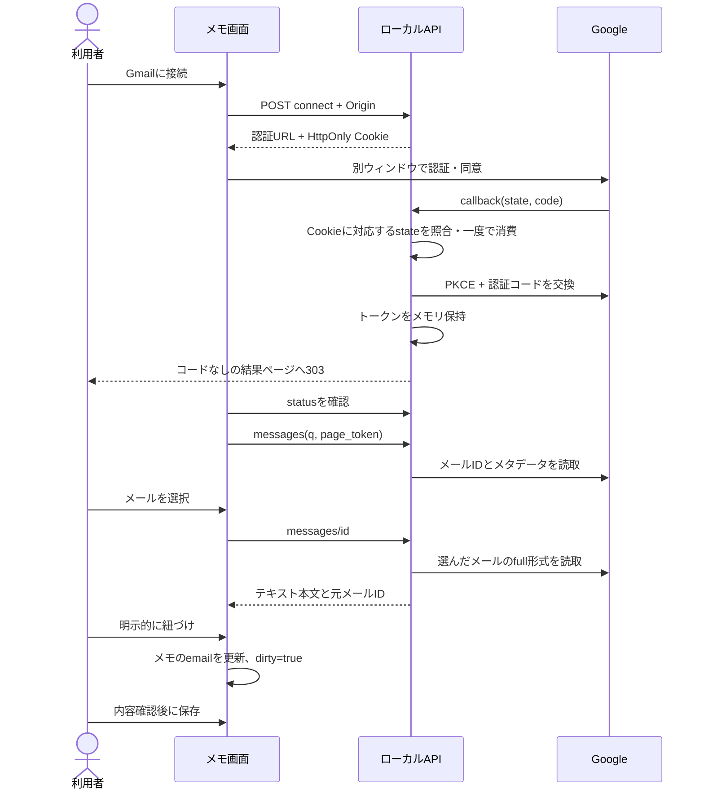

# Gmail連携: 設計・ADR・受入記録

日付: 2026-09-14 / ローカル構築済み、正常系の実接続は本人確認済み

初期要求・設計判断の記録を含む。後続のSQLite保存は[保存設計](17-sqlite-persistence.md)、実接続の本人確認結果と追加試験は[受入記録](19-gmail-live-acceptance.md)を正本とする。

## Inception: 追加要求

初期の明示的な指示は「Gmail連携を優先する」「まだ作成していないので設定手順もほしい」。当時は永続保存の先行実装を保留し、Google Cloudの準備からメール選択までを作業単位とした。この指示自体を実接続や細部設計の承認とは扱わない。

ユーザーストーリー:

- 利用者として、Gmailから必要なメールを検索・選択し、手作業の転記を減らしたい。
- 利用者として、取り込む前にメール本文を確認し、既存のメモを失わずに紐づけたい。
- 利用者として、接続を解除でき、設定不足・失効・通信障害を区別したい。
- 開発者として、実メールや秘密情報を使わずに認証境界をテストしたい。

非対象: 利用者ログイン、永続DB、メール送信・削除・既読変更、常時同期、全件取込、添付API、Bedrock、クラウドデプロイ。

## Construction: データフロー

画面のメール一覧は10件単位で追加取得。検索語はGmailのqへそのまま渡し、独自の検索構文は作らない。本文は選択時だけ取得する。UIは元画面を維持し、ポップアップの状態ではなくAPIの接続状態を確認する。ポップアップ側のセキュリティ方針によってwindow.closedが変わる場合も、それだけで認証失敗と判定しない。

一覧は短いsnippet、詳細はMIME本文をEmailLink.snippetへ格納する。multipart/alternativeではtext/plainを優先し、HTMLは標準HTMLParserで文字列化する。script/style/headを除き、画像やリンク先を読み込まない。添付パートは抽出対象外で、添付APIを呼ばない。本文は20,000文字まで、深さ20まで、各エンコード本文は先頭262,144文字まで処理する。読み取れる本文がない場合は短いsnippetへ戻す。暗号化メール・複雑なMIME・文字化けは完全対応を保証しない。

## Security: 実装境界

| 対象 | 実装 | 制約・残課題 |
| --- | --- | --- |
| OAuth | Google公式google-auth-oauthlib、認可コード、PKCE S256 | 正常系は本人が実接続確認。再接続・権限失効等の実試験は未報告 |
| state | セッションに結び付け、10分以内、比較後に一度だけ消費 | API再起動で失効 |
| Cookie | 256bitのランダムID、HttpOnly、SameSite=Lax、Gmailパス限定 | HTTPループバック限定。Secure Cookieを使う本番設定は未実装 |
| セッション | サーバーメモリ、12時間、上限100件、期限切れを除去、セッション単位のロック | 単一APIプロセス用。自動reload/複数worker不可 |
| 秘密情報 | .envはGit除外、ID・secretはサーバーのみ | .envの暗号化保管はしていない。端末の保護が必要 |
| トークン | ブラウザーへ返さずメモリ保持、公式ライブラリで更新 | KMS/Secrets Manager/永続保管は後続 |
| アクセス | ローカルHost検証、callback/result以外はOrigin完全一致 | アプリ利用者の認証ではない。ローカルの別プログラムからの保護ではない |
| ログ | UvicornのGmail URLからqueryを除去、例外を安全なコードに変換 | 外部プロキシやAPMを追加する際は別途設定 |
| 表示 | no-store、no-referrer、nosniff、Reactでテキスト描画、認証結果はスクリプト禁止CSP | 本文をdangerouslySetInnerHTMLで描画しない |
| 解除 | ローカル消去を先に行い、Googleにも失効要求。失敗はrevoked=false | API再起動・期限切れはGoogle権限を自動撤回しない |

Gmailに接続したブラウザーとは別のセッションでGmail取得APIを使うことはできない。一方、**メモAPI自体は利用者分離がない**ため、保存後のメール本文は同じローカルAPIを使うクライアントから見える。実業務利用不可の根拠であり、Gmailのセッション分離だけで安全な業務システムと扱わない。

メールは非信頼のデータであり、その文章を命令として実行しない。この段階で外部AIへメールを送らない。

## ADR-005: ローカルGmailを先行

状態: 実装上の判断。Gmail優先はユーザー指示、以下の細部の人間レビューは未完了。

採用: ウェブクライアントOAuth + gmail.readonly + Google公式Pythonライブラリ + メモリセッション + popup + 明示的な1件選択。

理由: 既存FastAPIを認証コード交換の境界とし、フロントへシークレットやトークンを渡さない。先行する永続保存を保留するユーザー意向に合わせて、DB・Cognitoの未完成な機能をGmail接続の前提に増やさない。

代替: メール手入力のみは残すが今回の主目的を満たさない。ブラウザー内のトークン保管は採用しない。デスクトップ専用認証フローはWebアプリという将来像と異なる。永続トークン保存は、アプリ認証・所有者境界・暗号化・削除機能と一緒に後続で検討する。

結果: API再起動・12時間後には再接続が必要。Gmailは読み取り専用だが広いメールアクセスを許可するrestricted scopeであり、公開条件の審査・評価が別途必要。テスト用の架空メールでのみ検証する。

## Test Strategy

- 外部通信を禁止し、偽providerでセッション分離・state不一致・再送・期限切れ・拒否・トークン交換失敗・未設定を検証。
- 検索条件・ページトークン・元メールID付きメモ保存・不正入力・失効・レート上限を検証。
- MIMEのplain優先・HTMLテキスト化・添付除外・抜粋フォールバック・長さ制約を検証。
- 実際のGoogle公式ライブラリのPKCE/スコープと、HTTP応答を模擬したアクセストークン更新を検証。
- 解除失敗時もローカルトークンが残らないことと、ログへ認証コードを出さないことを検証。
- ブラウザーで未設定・検索・一覧・プレビュー・紐づけ・狭幅を確認。模擬メールによる画面確認を実Gmail接続とは区別する。
- Google設定後の実OAuthからメール取得・保存後の保持・解除までは本人が確認。権限失効・再接続などの追加条件は受入記録で管理する。

## Operations: リリース境界

設定・起動・障害対応は[Gmail設定手順](../gmail-setup.md)を参照。localhost/127.0.0.1を混在させず、通常のブラウザー内で接続と操作を完結させる。API再起動前にメモの退避とGoogle権限解除の必要性を確認する。検証は架空メールのみとする。

本番へ進める条件は、利用者ログイン、所有者検証、暗号化永続保存、データ削除、保持期間、公開審査・同意、監査ログ、実接続試験、リリースの人間承認。AWSデプロイやGitHub公開は今回実施しない。

## 公式参照

- [WebサーバーOAuth](https://developers.google.com/identity/protocols/oauth2/web-server): 認可コード交換、リダイレクト、state、失効
- [Google公式Flow](https://googleapis.dev/python/google-auth-oauthlib/latest/reference/google_auth_oauthlib.flow.html): PKCE・認証フロー
- [Gmail一覧](https://developers.google.com/workspace/gmail/api/reference/rest/v1/users.messages/list): 検索とページング
- [Gmailメッセージ](https://developers.google.com/workspace/gmail/api/reference/rest/v1/users.messages): MIME構造と受信時刻
- [Gmailスコープ](https://developers.google.com/workspace/gmail/api/auth/scopes): 読み取り範囲と公開時の確認事項
