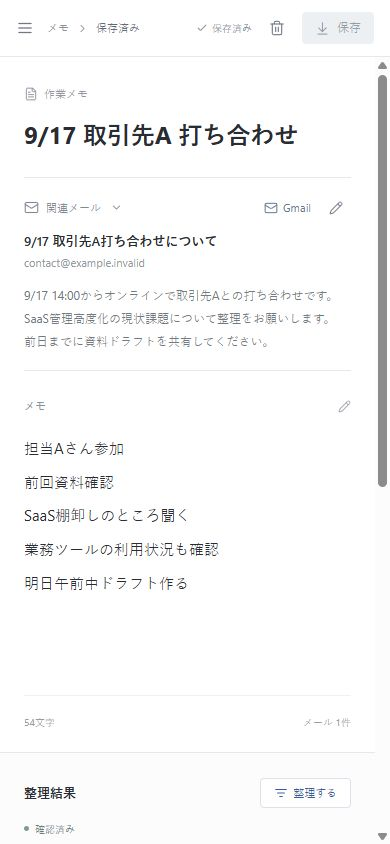
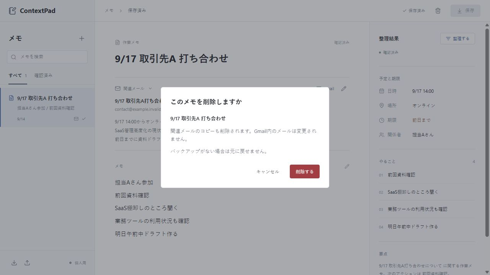

# ContextPad 90秒デモ手順

状態: 実演用台本と画面例。録画済み動画ではない。初期サンプルまたは自分で作った架空データだけを使う。

## 準備

[README](../README.md)からローカル起動する。実メールや認証設定を表示しない。画面例のメールは手入力サンプルで、Gmail実接続を示すものではない。

保存済みの実データがある環境では実演せず、APIを止めて別の新規 `CONTEXTPAD_DB_PATH` を指定する。データを消さずに作業環境を分ける。削除を見せる前には必ずバックアップ実ファイルを確認する。

## 実演

| 目安 | 操作 | 説明すること |
| --- | --- | --- |
| 0〜15秒 | 関連メールと雑メモを示す | メールと作業メモの文脈を一画面に集める |
| 15〜30秒 | 「整理する」 | 日時・場所・期限・関係者・準備タスクを原文と並べて確認。現在は決定的なローカル抽出 |
| 30〜45秒 | 「保存」→「確認済みにする」 | 自動抽出結果を未確認のまま確定扱いにしない |
| 45〜60秒 | メモを1行修正し再保存 | 同じメモを更新し、以前の確認済み状態は解除 |
| 60〜75秒 | 件名で検索、ページ再読込 | 保存済み内容を読み直せる。API再起動も自動試験済みであることを補足 |
| 75〜90秒 | 左下からバックアップ、削除確認を開いてキャンセル | 保存・持ち出し・データ保護まで一連の流れとして見せる |

Gmailについて聞かれたら、実接続未検証の段階ではそのまま説明する。OAuthのコードや失効試験があることと、実アカウントで動作確認したことを混同しない。

## 追加の受入確認

1. 検証用メモを保存し、バックアップJSONの存在を確認する。
2. 削除対象の件名を確認して削除し、一覧から消えることを確認する。
3. そのJSONを選び、表示された件数・ファイル名を確認して復元する。
4. メモ・メール・日時・確認状態が元と同じであることを確認する。
5. 同じJSONを再読込し、重複が増えないことを確認する。

バックアップからの復元は新規IDの追加が基本。現在と内容が違う同じIDは上書きせず中止される。過去版を確認する場合は別の新規DBで復元する。

## 画面例

