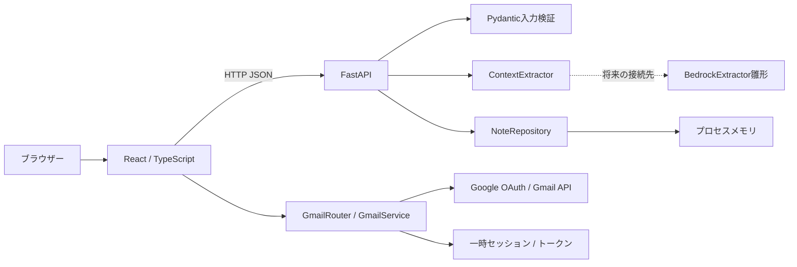
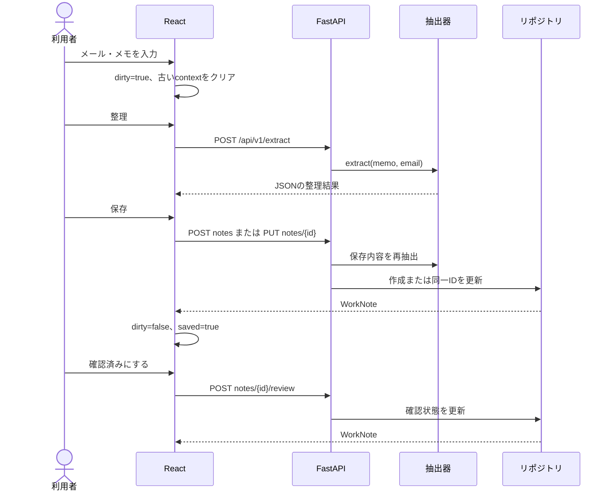
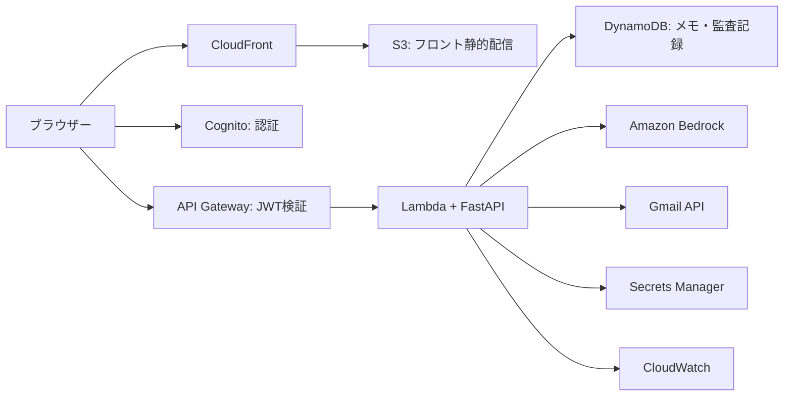

# ContextPad 基本・詳細設計書

文書版: 0.2 / 更新日: 2026-09-14 / 対象: 現行実装と将来構成案

## 1. 実装構成

ブラウザーは通常 `127.0.0.1:5173`、APIは `127.0.0.1:8000`。`VITE_API_BASE` は公開設定であり、秘密鍵やトークンを入れない。CORSは既定の両ローカル表記とAPP_WEB_ORIGINを許可するが、GmailのブラウザーAPIはAPP_WEB_ORIGINとの完全一致を追加検証する。Hostはlocalhost/127.0.0.1のみ。Gmailは同じホスト名のローカルHTTP構成に限定し、クラウド用構成は別途設計する。

## 2. モジュールの責務

| ファイル | 責務・制約 |
| --- | --- |
| `apps/web/src/main.tsx` | Appの状態、一覧・編集・整理画面、API呼び出し、失敗表示 |
| `apps/web/src/api.ts` | Cookie付き通信、上限時間、共通メール型とエラー |
| `apps/web/src/GmailPicker.tsx` | 接続・検索・プレビュー・選択・解除、ダイアログのフォーカス管理 |
| `apps/web/src/styles.css` | ニュートラル配色、3列構成、狭幅表示、フォーカス、動作低減 |
| `apps/web/index.html` | 起動時の代替表示。JSが読み込めない場合も案内を残す |
| `apps/api/app/main.py` | 7本の業務・ヘルスAPI、Gmailルーター登録、CORS・Host・応答ヘッダー |
| `apps/api/app/gmail.py` | 設定、Cookieとstateの照合、一時セッション、Gmail用7ルート、アクセスログのクエリー除去 |
| `apps/api/app/gmail_provider.py` | Google公式認証ライブラリ、Gmailの読取・失効要求、MIME本文のテキスト化 |
| `apps/api/app/models.py` | 入出力の型、UUID、UTC日時、最小文字数、確認状態 |
| `apps/api/app/extractor.py` | 日本語文字列からの決定的抽出。外部通信しない |
| `apps/api/app/repository.py` | 辞書による作成・読取・検索・更新・確認状態変更 |
| `apps/api/app/bedrock_adapter.py` | JSONプロンプト構築と応答モデル検証。実行経路から未使用 |

依存方向はルートからモデル・抽出・リポジトリへ向ける。DBや生成AIのクライアントは、画面やルートから直接呼ばず、今後サービス境界へ追加する。

## 3. 現行データモデル

`WorkNote` はメールと抽出結果を埋め込んだJSONオブジェクト。現在のモデルに `user_id`、独立したメールID、変更履歴はない。

| WorkNoteの項目 | 型・制約 |
| --- | --- |
| `id` | UUID文字列。作成時に付与し、更新しても維持 |
| `title` | 1文字以上の文字列。UIで空なら「無題のメモ」 |
| `memo` | 1文字以上の文字列 |
| `email` | EmailLinkまたはnull |
| `context` | ExtractedContext |
| `created_at` / `updated_at` | UTCの日時。更新時はupdated_atのみ変更 |

| EmailLinkの項目 | 型・初期値 |
| --- | --- |
| `provider` | `gmail` 固定 |
| `provider_message_id` | stringまたはnull。Gmail選択時に元メールIDを保持 |
| `subject` / `sender` / `snippet` | string、既定値は空文字。senderはメール形式検証なし |
| `received_at` | datetimeまたはnull。GmailのinternalDateをUTCに変換 |

| ExtractedContextの項目 | 型・意味 |
| --- | --- |
| `summary` | string、テンプレートで作る要点 |
| `event_datetime` / `location` / `deadline` | stringまたはnull。正規化前の表記 |
| `people` / `tasks` | string配列、抽出器はそれぞれ最大10件 |
| `confidence` | 0〜1。現行抽出器の上限0.95。UI非表示 |
| `ai_model` | 現行は `local-deterministic-extractor` |
| `review_status` | `ai_generated` または `human_reviewed` |

画面側のDocumentは、これに `saved`・`dirty` とnullableなcontextを加える。未保存IDは `draft-` で始まる。これらはAPIの保存スキーマに含まれない。

## 4. 処理フロー

保存時にも再抽出する。将来非決定的なモデルに切り替える場合は、確認した結果と保存結果が一致するよう抽出バージョンIDなどの設計を追加する必要がある。

## 5. 抽出アルゴリズム

1. メール抜粋とメモを結合し、検索用に空白を圧縮する。
2. タスクはメモを改行・句点で分割し、「確認」「作る」「共有」「整理」「聞く」「準備」「見る」「送る」「調査」を含む行を先頭10件まで採用する。
3. 人物は日本語または英字に敬称が続く表記を抽出し、重複を除いて先頭10件まで採用する。
4. 日時は月日・時刻のパターンを優先して最初の一致を採用する。年の決定、妥当な暦日かの検証、相対日の変換はしない。
5. 場所は助詞の前後から候補を取り、会議等の語を取り除くため、一般的な日本語を常に正しく解析できるものではない。
6. 期限は「前日まで」「明日」等のパターンから採用する。イベントとの前後関係は計算しない。
7. 件名と先頭タスク等を使って要点を生成する。
8. 検出項目の有無から内部スコアを計算する。

## 6. 状態・検索・例外

一覧はAPIから起動時に読み込み、ブラウザー内の下書きと統合する。入力中に取得が終わっても同じIDを重複追加しない。UI検索はtitle・memo・email.subjectが対象で、API検索にはcontext.tasksも含まれる。API一覧は作成日時の降順であり、更新時の自動並び替えではない。

HTTP失敗・通信例外・原則30秒のタイムアウトは画面で捕捉し、処理中状態を解除する。Gmail一覧は10件分のメタデータ照会を伴うため120秒。認証待ちは最大10分で状態だけを確認し、アクセストークン更新は公式ライブラリを使う。一般的な業務APIの自動再試行や楽観ロックは未実装。複数タブで同じメモを更新すると後勝ちになる。

APIエラーは現在FastAPIの標準 `detail` 形式。定義だけ存在する `ErrorEnvelope` は使われていない。

## 7. AWS構成案（未接続）

2026-09-14追記: 無料で進めるユーザー指示により、以下は将来の比較・移行設計としてのみ保持する。現在の開発対象はローカル版であり、AWSやBedrockはデプロイ・課金有効化しない。[無料構成と工程](ai-dlc/16-free-development-roadmap.md)を優先する。

初期クラウド版の候補はLambdaとDynamoDB。これは決定済みの本番構成ではない。複雑な検索・集計・関係データが必要になった場合はRDS PostgreSQL、長時間処理や常駐処理が必要になった場合はECS Fargateを再評価する。代替案をすべて同時に構築しない。

| 構成要素 | リポジトリの状態 |
| --- | --- |
| Cognito | User Pool / ClientのTerraform雛形あり。Hosted UI・JWT検証は未接続 |
| S3 | バケットと公開ブロックの雛形あり。配信経路は未完成 |
| DynamoDB | pk/sk、オンデマンド容量、暗号化の雛形あり。APIは未接続 |
| Secrets Manager / CloudWatch | シークレット格納先とロググループの雛形のみ |
| API Gateway / Lambda / ECS / CloudFront / RDS | リソース実装なし |
| Bedrock | 実呼び出しなし |
| Gmail OAuth | ローカル用実装あり。認証情報・実接続検証・クラウド対応は未完了 |
| GitHub Actions | テスト・ビルド・Terraform検証の設定のみ。デプロイなし |

`runtime_mode` 変数は宣言だけでリソースの切り替えに使われていない。シークレットの値も定義していない。現状のTerraformを適用してもサービス全体は稼働しない。

## 8. クラウド版のセキュリティ設計案

- Cognitoの検証済みトークンから所有者を特定し、すべてのメモ・メール・検索に所有者条件を付ける。クライアント申告のuser_idを信用しない。
- Gmail OAuthはCognitoログインとは別の連携。stateの検証、リダイレクトURI制約、トークン保護、切断・削除フローを実装する。
- メール本文を読む候補スコープ `gmail.readonly` は制限付きスコープ。公開範囲・サーバー保存等に応じた検証やセキュリティ評価を確認する。[Google公式スコープ資料](https://developers.google.com/workspace/gmail/api/auth/scopes)
- メール中の文章は命令として実行せず、抽出対象データとして扱う。原文・トークンをログへ出さず、AI出力の型・長さ・出典・モデルIDを検証・記録する。
- Bedrockの候補はConverse API。利用モデル・リージョン・権限・費用を確認して実装する。現行アダプターにある既定モデルIDは接続実績を意味しない。[AWS公式Converse資料](https://docs.aws.amazon.com/bedrock/latest/userguide/conversation-inference.html)
- 自動デプロイ認証はGitHub OIDCと短期権限を候補とし、保存データの暗号化、バックアップ、保持・削除方針を合わせて設計する。

API認証、実データの保存、公開環境の運用は別のレビュー対象とする。

## 9. Gmail連携の追加設計

接続のデータフロー、MIME処理、セッション寿命、APIの契約、セキュリティ上の判断は[追加設計とADR](ai-dlc/15-gmail-integration.md)、初期設定は[Gmail設定手順](gmail-setup.md)を参照。Gmail OAuthは利用者ログインを代替しない。メモリ上のメモは利用者別には分離されていないため、テスト用の架空メールだけを扱う。
