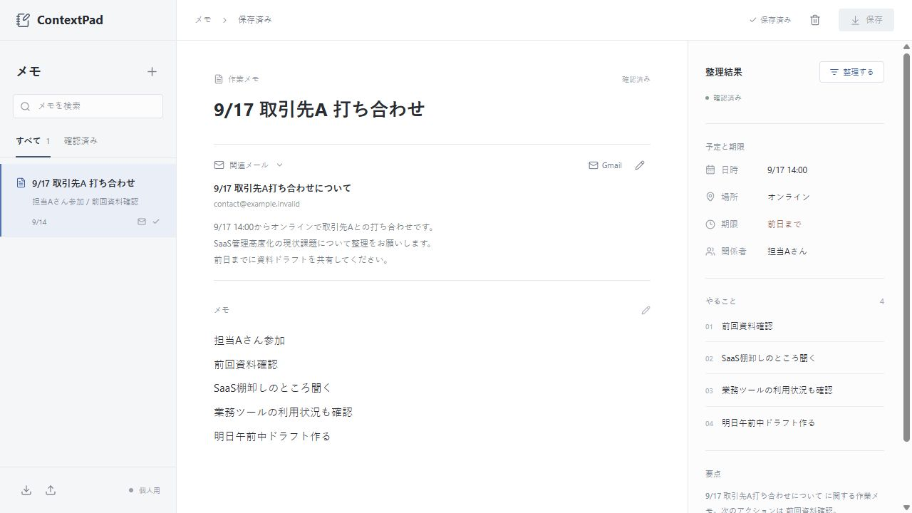

# ContextPad ポートフォリオ概要

## 作品概要

メールと雑メモを一つの作業単位にまとめ、日時・場所・人物・期限・タスクを並べて確認できるWebアプリ。予定やタスクの入力フォームから始めず、自由に書くメモを中心に設計した。

対象課題は、メール・メモ・やることが分散し、作業を再開するたびに文脈を探し直す手間。削減時間や継続利用率などの実ユーザー評価はまだ測定していない。

## 実装と検証

| 領域 | 現在の状態 |
| --- | --- |
| Web | React / TypeScript、メモ中心の編集画面、検索、狭幅対応 |
| API | FastAPI / Pydantic、作成・更新・確認・削除、入力とエラーの検証 |
| 保存 | SQLite、トランザクション、APIプロセス再起動後の復元 |
| バックアップ | バージョン付きJSON、別DB復元、ID衝突時に全体取消 |
| Gmail | 読み取り専用OAuth・検索・選択・解除のコードあり。実アカウントは設定待ち |
| 整理 | 正規表現・キーワードによる決定的抽出。生成AIではない |
| テスト | 50件のAPIテスト、型チェック・本番ビルドをローカル実行 |
| CI | GitHub Actions設定あり。リモート未登録のため外部実行結果なし |
| AWS / Bedrock | 将来構成と一部Terraform雛形のみ。未デプロイ・未接続 |
| AI-DLC | 要件、設計、ADR、試験・運用、人間の指示を文書化。公式ワークフロー全ゲート完了という主張ではない |

画面例は手入力の架空サンプル。実在企業・個人・実メールは使っていない。SQLiteとバックアップは平文であり、利用者認証や利用者別分離がないため実業務には使用しない。

## 説明できる設計判断

1. **メモを主役にした理由**: タスクフォームの入力負担を増やさず、後で文脈を整理する体験を優先。抽出結果より原文を残し、確認状態を別に持たせた。
2. **SQLiteを選んだ理由**: 追加料金0円という要求変更を受け、クラウドDBの稼働を保留。既存リポジトリ境界を維持し、再起動時のデータ消失を解消した。[ADR-006](ai-dlc/17-sqlite-persistence.md)
3. **復元で上書きしない理由**: バックアップの古い内容が現在のメモを壊すリスクを避ける。同じID・同じ内容は再試行可能にし、差異がある場合は全体を取消す。[ADR-007](ai-dlc/18-note-management.md)
4. **Gmailの境界**: サーバー側で認証コードを交換し、トークンをブラウザーへ渡さない。接続とメモ保存を分離し、メールは明示選択した1件だけ紐づける。[ADR-005](ai-dlc/15-gmail-integration.md)
5. **AIの出力をそのまま実績にしない理由**: 実装済み・案・未検証を区別。確認済みのメモを編集したら承認状態を解除する。開発時も人間の実際の指示と未承認事項を記録する。[レビュー履歴](ai-dlc/12-human-review-log.md)

## 実行と実演

[READMEの起動手順](../README.md) / [90秒のデモ手順](demo.md) / [仕様書](specification.md) / [基本・詳細設計](design.md) / [検証・運用](test-and-operations.md)

この作品はローカルで動く試作版。`127.0.0.1` は応募先が外部から開ける公開デモURLではない。追加サービス課金・AWSリソース作成・GitHub公開は行っていない。

## 応募前に残ること

- 専用テストアカウントでGmail認証・検索・紐づけ・解除・再接続を実確認し、機密情報を含めない結果を残す。
- 自分の端末で削除・ファイル復元の画面操作を受入確認する。APIでの復旧試験とは別に扱う。
- GitHubの公開先と公開範囲を決め、秘密情報・実データを検査してpushし、無料枠内でCIが成功した結果を確認する。
- [デモ手順](demo.md)を使った短い画面録画を用意する。現状はスクリーンショットと台本までで、録画はまだない。
- READMEの手順だけで別の環境から起動できるかを確認し、上の設計判断を自分の言葉で説明できるようレビューする。

機能を増やすことだけが次の目標ではない。実接続・再現性・本人の判断説明を揃える段階に進んでいる。生成AIやAWSを追加する場合も、必要性・費用・権限を再検討し、未実施の経験を記載しない。
