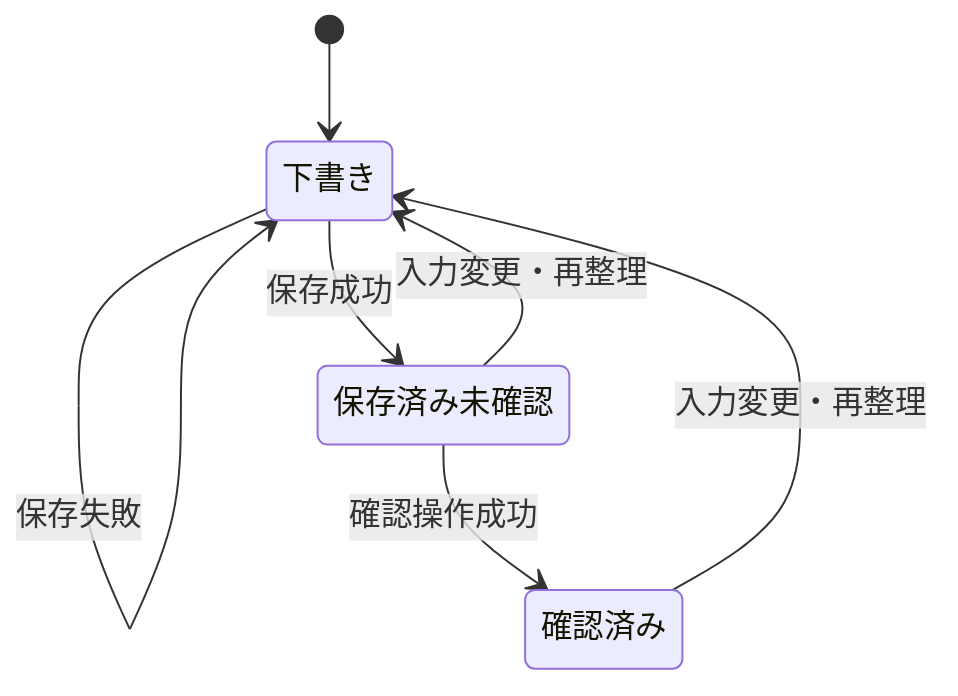

# ContextPad 仕様書

文書版: 0.4 / 更新日: 2026-09-14 / 状態: 現行実装の整理・受入レビュー待ち

## 1. 目的と課題

メールに書かれた予定や依頼と、自分の覚え書きが別々の場所にあると、作業前に文脈を読み直す必要がある。ContextPadは、メール1件と自由記述のメモを結び付け、日時・場所・人物・期限・タスクを同じ画面で確認できるようにする。

現在の目的はローカルで一連の操作を試せる試作版を作ること。Gmail連携は実装済み・認証設定と実接続試験待ち。メモはSQLiteへ保存する。将来は利用者認証・Bedrockによる抽出を備えた業務支援サービスにする。現行版を業務データの保管先として扱わない。

## 2. 想定利用者と利用シーン

| 利用者 | 困りごと | 利用シーン |
| --- | --- | --- |
| 案件担当者 | 依頼メールと準備事項が分散する | メール抜粋を貼り、打ち合わせ準備をメモする |
| 企画・調査担当者 | 不完全な覚え書きを後から読めない | 自由に書いたメモから確認事項を整理する |
| レビュアー | AI出力が正しいか判断したい | 元のメール・メモと抽出結果を比較する |

ローカル版は単一利用者を想定する。複数ユーザー、組織、共有、権限管理は未実装。

## 3. 機能と実装状況

| ID | 機能 | 現行仕様・状態 |
| --- | --- | --- |
| FR-01 | メモの新規作成 | 実装済み。無題・空本文の下書きを作成し、一覧から切り替えられる |
| FR-02 | メモ編集 | 実装済み。件名と本文を自由入力。本文に合わせて編集領域が伸びる |
| FR-03 | メールの紐づけ | 実装済み。1メモに0または1件。手入力またはGmailから選択。置き換え時は未保存・未確認に戻る |
| FR-04 | メールの表示 | 実装済み。折りたたみ、インライン編集、紐づけ解除 |
| FR-05 | 内容整理 | 実装済み。正規表現・キーワードによるローカル抽出。生成AI呼び出しではない |
| FR-06 | 保存・更新 | 実装済み。新規はPOST、既存はPUT。同じIDで更新し、再抽出する |
| FR-07 | 一覧・検索 | 実装済み。起動時に一覧取得。UI検索は件名・本文・関連メール件名の部分一致 |
| FR-08 | 内容確認 | 実装済み。保存した抽出結果全体を確認済みにする。項目別承認ではない |
| FR-09 | 確認済み一覧 | 実装済み。確認済みのレコードだけに絞り込む |
| FR-10 | 失敗通知 | 実装済み。整理・保存・一覧取得に失敗したことを表示。編集本文は画面に残る |
| FR-11 | 永続保存 | SQLiteにメモ・関連メール・抽出結果・確認状態を保存。API再起動後も復元。下書きとOAuthトークンは対象外 |
| FR-12 | 削除・履歴・共有 | 確認後のメモ削除を実装。Gmail原本は変更しない。履歴・共有・ゴミ箱はない |
| FR-14 | バックアップ・復元 | 保存済みメモをJSON出力・復元。上限1,000件・5MiB。ID衝突時に上書きしない |
| FR-13 | Gmail OAuth・取得 | 接続・読み取り専用検索・10件単位の追加読込・本文確認・選択・接続解除を実装。Google設定と実接続試験待ち。送信・削除・既読変更なし |
| FR-14 | Bedrock抽出 | プロンプト構築・応答検証の雛形のみ。実際のモデル接続は未実装 |
| FR-15 | 抽出項目の直接編集 | 未実装。元のメモ・メールを直し、再整理する |
| FR-16 | 認証と利用者分離 | 未実装。クラウド版でCognitoと所有者検証を追加予定 |

## 4. 画面仕様

| 領域 | 内容 | 操作 |
| --- | --- | --- |
| メモ一覧 | 検索、件名、本文抜粋、下書きまたは更新日 | 新規、選択、検索、確認済みフィルター |
| 上部ツールバー | 保存状態、保存ボタン | 未保存かつ本文が空白だけでない場合に保存可能 |
| メモ編集面 | 件名、関連メール、自由記述、文字数 | 件名・本文の変更、メールの編集 |
| 整理結果 | 日時、場所、期限、関係者、最大10件のタスク、要点 | 整理、確認済みにする |
| 通知 | 成功または失敗の短いメッセージ | 閉じる |
| Gmail選択ダイアログ | 未設定・未接続・接続待ち・一覧・プレビュー・失敗・該当なし | 設定手順、接続、検索、追加読込、メールの選択と紐づけ、接続解除 |

デスクトップは3列構成。1020px以下では整理結果を編集面の下へ移し、680px以下では一覧を開閉式にする。画面に広告的な説明文、大きなAIバッジ、信頼度パーセントを表示しない。アイコンには操作名を付ける。

## 5. 保存と確認状態

- `dirty` と未保存下書きのIDはブラウザー内の状態。APIの `review_status` とは別に管理する。
- 件名・本文・メールの変更は、画面内の抽出結果を無効化する。再整理は保存前の結果として扱う。
- 保存は抽出も実行する。確認済みだった既存メモも、内容更新後は未確認に戻る。
- 確認操作は保存済み・未変更のレコードにのみ表示上許可する。
- 同じページ内でメモを切り替えても下書きは残るが、ページを閉じると消える。未保存変更がある場合は離脱時にブラウザーの確認を要求する。
- APIを再起動すると保存済みメモも消える。複数プロセス間でデータを共有しない。

## 6. 抽出の境界

抽出結果は予定の確定や正確性を保証しない。現行の日時は文字列の抜粋で、年・タイムゾーンの補完や「明日」「前日まで」の日付化は行わない。タスクはメモだけから取り、メール本文から直接タスク一覧を生成しない。人物・場所の誤抽出もあり得る。

APIは内部値として `confidence` を返すが、抽出項目が見つかった数に応じたヒューリスティックであり、統計的な正答確率ではない。

## 7. 非機能要件

| ID | 現行の状態 | クラウド版の受入目標・未実装事項 |
| --- | --- | --- |
| NFR-01 安全なデータ利用 | 架空サンプル。画面の入力はローカルAPIへ送る | 認証・所有者チェック、最小権限、暗号化、削除・保持方針 |
| NFR-02 応答性 | UIは原則30秒、Gmail一覧は最大120秒で打ち切る | 代表データで非AI API p95 1秒以内、抽出p95 15秒以内を測定して判断 |
| NFR-03 信頼性 | SQLite、再起動・保存失敗試験、JSONバックアップ・復元試験 | 自動バックアップ、世代管理。RPO/RTOは運用前に決定 |
| NFR-04 操作性 | 日本語、可変高さの入力、狭幅対応、キーボードフォーカス | 読み上げ・コントラスト・タッチ操作の総合検証 |
| NFR-05 監査性 | GitとAI-DLC文書。APIには確認状態のみ | 誰が何を確認したかを保存するReviewEventと変更履歴 |
| NFR-06 再現性 | pnpmロック、型チェック、APIテスト | CIの外部実行確認、依存更新、環境ごとの再現試験 |
| NFR-07 コスト | ローカル版はAWS呼び出しなし | Bedrock実行上限、予算通知。月額予算は利用条件とともにレビュー |

上記の性能値は計測済みSLAではなく、クラウド版の提案値。

## 8. 受入条件

| ID | 操作 | 期待結果 |
| --- | --- | --- |
| AC-01 | 架空メールとメモを整理 | 日時・場所・人物・期限・タスクを表示し、原文は残る |
| AC-02 | 保存後に本文を修正して再保存 | IDと作成日時を保持し、一覧件数は増えない |
| AC-03 | 確認済みメモを変更 | 古い確認済み状態をそのまま新内容に適用しない |
| AC-04 | 件名で検索、一致しない語で検索 | 一致する一覧、または該当なし表示に切り替わる |
| AC-05 | 390px幅で開く | 横スクロールせず、メモ一覧を開閉できる |
| AC-06 | APIとの接続が失敗 | 編集本文を消さずに失敗を通知し、操作中状態を解除 |
| AC-07 | ソース・テスト・文書を公開前確認 | 実在の取引先名、実メール、トークンを含まない |
| AC-08 | Gmail設定がない状態で開く | アプリは表示され、Gmail内に設定手順が表示される |
| AC-09 | Gmailでメールを選択 | 件名・送信者・日時・元メールID・本文を下書きに紐づける。明示的な選択までは既存メールを変更しない |
| AC-10 | 認証拒否・期限切れ・権限失効・取得失敗 | 秘密情報を表示せず、元のメモを残す。401時は再接続を要求する |
| AC-13 | 削除確認をキャンセル | メモを残す。確認して削除した場合もGmail原本を変えない |
| AC-14 | バックアップを別DBに復元 | 本文・メール・ID・日時・確認状態が一致 |
| AC-15 | 同じバックアップを再取込、内容衝突、不正ファイル | 同一内容は重複しない。衝突・入力不正なら全体を変更しない |
| AC-12 | 保存・編集・確認後にAPIを再起動 | ID・作成日時・本文・メール・確認状態を保持。Gmail接続は再認証 |
| AC-11 | Gmail接続解除 | ローカルトークンを消去。Google側の失効要求に失敗した場合は未確認と明示する |
